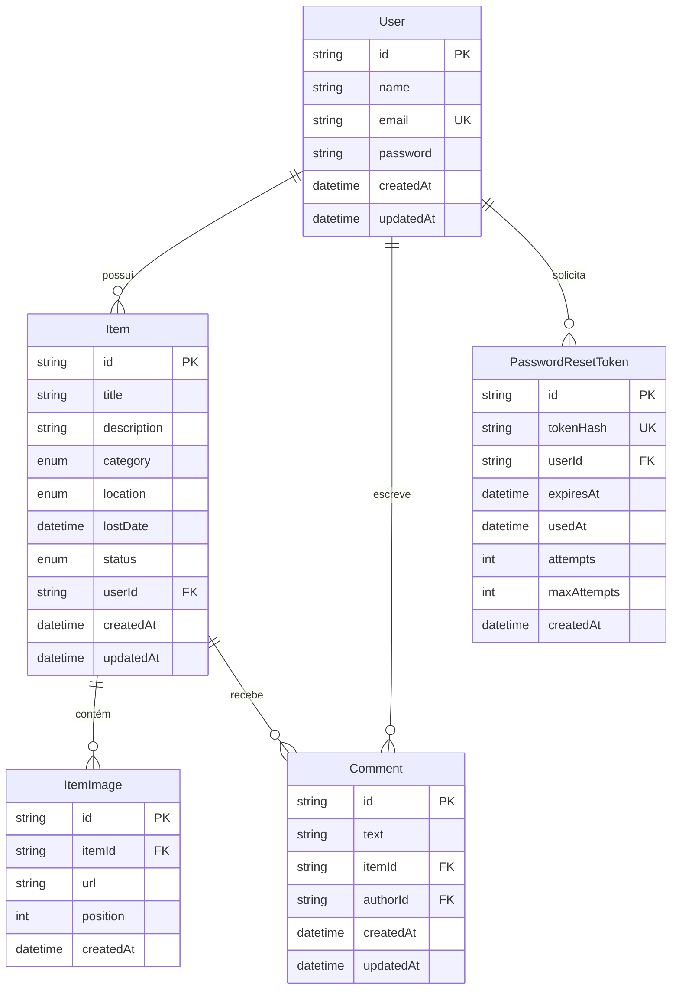

# UVV Achados & Perdidos

Sistema de achados e perdidos para a Universidade de Vila Velha (UVV), com backend em Clean Architecture e frontend React.

## Stack

- Backend: Node.js + Express + TypeScript + Prisma
- Frontend: React + TypeScript + Vite + Tailwind CSS
- Banco: PostgreSQL (Docker)

## Pré-requisitos

- Node.js 20+
- npm 10+
- Docker e Docker Compose

## Configuração de ambiente

### 1) Arquivos `.env`

Na raiz do projeto e no backend:

```bash
# na raiz
cp .env.example .env

# backend
cp backend/.env.example backend/.env
```

### 2) SMTP Gmail (recuperação de senha)

No `backend/.env`, configure:

```env
SMTP_HOST=smtp.gmail.com
SMTP_PORT=587
SMTP_SECURE=false
SMTP_USER=seuemail@gmail.com
SMTP_PASS=sua-app-password-do-google
SMTP_FROM="UVV Achados <seuemail@gmail.com>"
```

Observação: `SMTP_PASS` deve ser App Password (Google com 2FA ativo).

## Rodando o projeto

### 1) Subir banco

```bash
docker compose up -d
```

### 2) Backend

```bash
cd backend
npm install
npm run prisma:migrate
npm run prisma:generate
npm run dev
```

API em `http://localhost:3333`.

### 3) Frontend

```bash
cd frontend
npm install
npm run dev
```

App em `http://localhost:5173`.

## Scripts úteis

### Backend

- `npm run dev`: inicia com hot reload
- `npm run build`: compila TypeScript
- `npm run start`: roda build de produção
- `npm run prisma:migrate`: aplica migrações
- `npm run prisma:generate`: gera cliente Prisma
- `npm run prisma:studio`: abre Prisma Studio

### Frontend

- `npm run dev`: ambiente local
- `npm run build`: build de produção
- `npm run preview`: pré-visualização local do build
- `npm run lint`: validação de lint

## Modelagem do Banco de Dados

### DER (Diagrama Entidade-Relacionamento)



### Estrutura das Tabelas

| Tabela | Colunas | Descrição |
|--------|---------|-----------|
| **User** | `id` (UUID, PK), `name`, `email` (unique), `password` (hash), `createdAt`, `updatedAt` | Usuários cadastrados |
| **Item** | `id` (UUID, PK), `title`, `description`, `category` (enum), `location` (enum), `lostDate`, `status` (enum: PERDIDO/ENCONTRADO), `userId` (FK), `createdAt`, `updatedAt` | Itens perdidos/encontrados |
| **ItemImage** | `id` (UUID, PK), `itemId` (FK), `url`, `position` (ordem), `createdAt` | Imagens dos itens |
| **Comment** | `id` (UUID, PK), `text`, `itemId` (FK), `authorId` (FK), `createdAt`, `updatedAt` | Comentários nos itens |
| **PasswordResetToken** | `id` (UUID, PK), `tokenHash` (unique), `userId` (FK), `expiresAt`, `usedAt`, `attempts`, `maxAttempts` (default: 5), `createdAt` | Tokens de recuperação de senha |

### Relacionamentos

| Origem | Destino | Tipo | Regra |
|--------|---------|------|-------|
| User | Item | 1:N | Um usuário pode cadastrar vários itens |
| User | Comment | 1:N | Um usuário pode fazer vários comentários |
| User | PasswordResetToken | 1:N | Um usuário pode solicitar vários tokens de recuperação |
| Item | ItemImage | 1:N | Um item pode ter várias imagens (cascade on delete) |
| Item | Comment | 1:N | Um item pode receber vários comentários (cascade on delete) |

### Enums

| Enum | Valores |
|------|---------|
| **Category** | `ELETRONICOS`, `DOCUMENTOS`, `ACESSORIOS`, `MATERIAIS_ESCOLARES`, `OUTROS` |
| **Location** | `BIBLIOTECA`, `LABORATORIOS`, `CANTINA`, `SALAS_DE_AULA`, `AREAS_COMUNS` |
| **Status** | `PERDIDO`, `ENCONTRADO` |

## Testes Realizados

### Testes Unitários

Testes focados em validar o comportamento de componentes isolados (funções, classes, casos de uso) sem dependências externas (banco, rede, sistema de arquivos):

| Módulo | O que testar |
|--------|-------------|
| **Entities** | Regras de domínio — validação de dados, transição de status (`PERDIDO` → `ENCONTRADO`), cálculo de datas |
| **Usecases** | Fluxos de negócio — criação de item, registro de usuário, recuperação de senha, autorização de ações |
| **Validators** | Regras de entrada — formato de e-mail institucional (`@uvv.br`, `@uvvnet.com.br`), campos obrigatórios, tamanho máximo de texto |
| **Services (frontend)** | Chamadas HTTP (axios) — construção correta de URLs, envio de headers de autenticação, parsing de respostas |
| **Hooks** | Lógica de estado — formulários, listas com paginação, filtros por categoria/local |

### Testes de Integração

Testes que verificam a comunicação entre camadas e componentes reais:

| Cenário | Fluxo |
|---------|-------|
| **Repositório + Banco** | CRUD de itens via Prisma — inserir, listar por categoria, buscar por usuário, deletar com cascade de imagens |
| **Controller + Usecase + Repository** | Cadeia completa de uma requisição HTTP — autenticação → criação de item → persistência → resposta |
| **Frontend + API** | Serviço axios → requisição real ao backend → tratamento de sucesso/erro → atualização de estado no React |
| **Autenticação** | Registro → login → JWT → acesso a rotas protegidas → refresh de token |
| **Recuperação de senha** | Solicitação → envio de e-mail (SMTP mockado) → reset com token → nova autenticação |

### Testes Funcionais

Testes de ponta a ponta simulando o comportamento do usuário no navegador:

| Fluxo | Passos |
|-------|--------|
| **Cadastro e login** | Preencher formulário de registro → submeter → redirecionar ao login → autenticar → acessar dashboard |
| **Registro de item perdido** | Clicar em "Perdi um item" → preencher título, descrição, categoria, local, data → anexar imagem → salvar |
| **Registro de item encontrado** | Clicar em "Encontrei um item" → preencher dados → definir status como ENCONTRADO → publicar |
| **Busca e filtros** | Navegar pela lista de itens → filtrar por categoria → filtrar por local → buscar por termo no título |
| **Comentários** | Abrir detalhe de um item → digitar comentário → postar → visualizar comentário na lista |
| **Recuperação de senha** | Clicar em "Esqueci minha senha" → informar e-mail → receber link → definir nova senha → logar |

### Testes de Usabilidade

Avaliação da experiência do usuário com base nos princípios de design da interface:

| Aspecto | Critério |
|---------|----------|
| **Navegação** | Rotas claras e consistentes entre páginas; breadcrumb ou menu indicando localização atual |
| **Formulários** | Feedback visual de erros (validação inline); botão desabilitado durante envio; mensagens de sucesso/erro após submissão |
| **Responsividade** | Layout adaptável para desktop, tablet e mobile; componentes refluindo corretamente em telas estreitas |
| **Acessibilidade** | Contraste adequado de cores; labels associados a inputs; navegação por teclado (tab index) |
| **Feedback** | Loading states durante requisições; toasts/alertas para ações confirmadas (criação, edição, exclusão) |
| **Consistência** | Mesmo padrão visual em botões, cards, modais e formulários em toda a aplicação |

## Rotas de autenticação

- `POST /auth/register`
- `POST /auth/login`
- `POST /auth/recover-password`
- `POST /auth/reset-password`

## Regras de e-mail institucional

Cadastro, login e recuperação aceitam:

- `@uvv.br`
- `@uvvnet.com.br`

## Estrutura do projeto

```text
.
├─ backend/                          # API Express com Clean Architecture
│  ├─ prisma/                        # Schema e migrações do banco
│  └─ src/
│     ├─ entities/                   # Entidades de domínio
│     ├─ usecases/                   # Casos de uso (regras de negócio)
│     ├─ adapters/                   # Adaptadores de interface
│     │  ├─ controllers/             # Controladores HTTP
│     │  ├─ middlewares/             # Middlewares Express
│     │  ├─ repositories/           # Interfaces de repositório
│     │  ├─ services/               # Interfaces de serviço
│     │  └─ validators/             # Validadores de entrada
│     ├─ infrastructure/            # Implementações concretas
│     │  ├─ database/               # Conexão Prisma
│     │  ├─ http/
│     │  │  ├─ middlewares/         # Middlewares (auth, error)
│     │  │  └─ routes/              # Rotas da API
│     │  ├─ repositories/          # Implementações dos repositórios
│     │  └─ services/              # Implementações dos serviços
│     ├─ shared/
│     │  └─ errors/                 # Classes de erro customizadas
│     ├─ generated/                  # Tipos gerados pelo Prisma
│     └─ types/                      # Tipos compartilhados
├─ frontend/                         # React + Vite + Tailwind CSS
│  └─ src/
│     ├─ components/
│     │  ├─ features/               # Componentes de funcionalidade
│     │  └─ ui/                     # Componentes base reutilizáveis
│     ├─ pages/                      # Páginas da aplicação
│     ├─ services/                   # Chamadas à API (axios)
│     ├─ contexts/                   # Contextos React
│     ├─ hooks/                      # Hooks customizados
│     ├─ routes/                     # Configuração de rotas
│     ├─ lib/                        # Utilitários e helpers
│     ├─ types/                      # Tipos TypeScript
│     └─ assets/                     # Assets estáticos
├─ .env.example                      # Template de variáveis de ambiente
└─ docker-compose.yml               # PostgreSQL container
```
